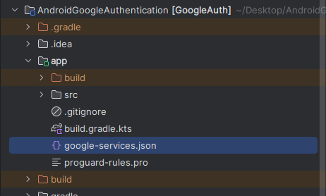

## Passo a passo: Autenticação Google no Android Studio 🚀

Siga este guia claro e conciso para configurar o Google Authentication em seu app Android usando Firebase.

---

### Git Repository 📁

[GitHub Repository: Android Google Authentication](https://github.com/KauanCalheiro/AndroidGoogleAuthentication)

---

### Sumário 📚

| **Seção**                                   | **Descrição**                                                                 |
|---------------------------------------------|-------------------------------------------------------------------------------|
| **Propriedades do Objeto `FirebaseUser` 🔍** | Descrição das propriedades disponíveis no objeto `FirebaseUser`.              |
| **Criar projeto no Android Studio 🆕**      | Passos para criar um novo projeto no Android Studio.                          |
| **Conectar o projeto ao Firebase 🔗**       | Guia para vincular o projeto Android ao Firebase.                             |
| **Adicionar Firebase Authentication SDK 🛠️**| Instruções para incluir a dependência do Firebase Authentication no projeto.  |
| **Configurar SHA-1 🔑**                     | Como gerar e configurar o SHA-1 no console do Firebase.                       |
| **Configuração do SDK 📄**                  | Download e inclusão do arquivo `google-services.json` no projeto.             |
| **Adicionar WebClient ID 🔐**               | Configuração do WebClient ID no arquivo `strings.xml`.                        |
| **Layout da Activity 🖼️**                  | Criação do layout da interface de autenticação no arquivo `activity_main.xml`.|
| **Estrutura de arquivos e build.gradle ⚙️** | Configuração dos arquivos `build.gradle` e sincronização do projeto.          |
| **MainActivity.java 📱**                    | Implementação do fluxo de autenticação no arquivo `MainActivity.java`.        |

---

#### Propriedades do Objeto `FirebaseUser` 🔍

O objeto `FirebaseUser` representa um usuário autenticado no Firebase. Ele contém informações sobre o usuário, como nome, e-mail, foto de perfil e muito mais.

Para mais detalhes, consulte a [documentação oficial](https://firebase.google.com/docs/reference/android/com/google/firebase/auth/FirebaseUser).

| **Property**      | **Type**                                            |
| ----------------- | --------------------------------------------------- |
| `DisplayName`     | `string`                                            |
| `Email`           | `string`                                            |
| `IsAnonymous`     | `bool`                                              |
| `IsEmailVerified` | `bool`                                              |
| `Metadata`        | `UserMetadata`                                      |
| `PhoneNumber`     | `string`                                            |
| `PhotoUrl`        | `System.Uri`                                        |
| `ProviderData`    | `System.Collections.Generic.IEnumerable<IUserInfo>` |
| `ProviderId`      | `string`                                            |
| `UserId`          | `string`                                            |

---

#### 1. Criar projeto no Android Studio 🆕

1. Abra o Android Studio e selecione **New Project**.
2. Escolha o template desejado (por exemplo, **Empty Activity**).
3. Defina nome, pacote e local de armazenamento.

---

#### 2. Conectar o projeto ao Firebase 🔗

1. No menu, vá em **Tools → Firebase**.
2. Selecione **Authentication → Authenticate Using Google [Java]**.
3. Clique em **Connect to Firebase** e siga o assistente para vincular seu projeto.
   

---

#### 2.1 Criação de um projeto na Firebase 🆕

1. Ao acessar o site do **Firebase**, vá em **Começar com um projeto do Firebase**.
    
2. Siga o passo a passo informado na plataforma e após concluir todos os tópicos, clique em **Conectar**.
    
3. Acessando novamente seu projeto no AndroidStudio verá a informação que está **Connected** ao seu projeto do **Firebase**.
    

---

#### 3. Adicionar Firebase Authentication SDK 🛠️

No arquivo **build.gradle (Module: app)**, inclua a dependência:


---

#### 4. Configurar SHA-1 🔑

1. Abra o terminal do Gradle (ícone do Elefante).
2. Execute:
    ```bash
    gradlew signingReport
    ```
    
    

3. Copie o **SHA-1** exibido. Exemplo:

    
4. No console do Firebase, acesse **Project settings → App** e clique em **Add fingerprint**.

5. Cole o SHA-1 e **salve**.

---

#### 5. Configuração do SDK 📄

No console do Firebase, acesse **Project settings → App** e clique em **google-services.json** para baixar o arquivo de configuração.


**Coloque**/**Substitua** o arquivo **google-services.json** na pasta **app/** do seu projeto Android.


---

#### 6. Adicionar WebClient ID 🔐

No arquivo **app/src/main/res/values/strings.xml**, adicione:

O WebClient ID pode ser encontrado no console do Firebase, na seção **Project settings → Authentication → Sign-in method**. Selecione **Google** e copie o **Web client ID**.
```xml
<resources>
    <string name="app_name">{{ YOUR_APP_NAME }}</string>
    <string name="client_id">{{ YOUR_WEB_CLIENT_ID }}</string>
</resources>
```

---

#### 7. Layout da Activity 🖼️

No **activity_main.xml**, crie o layout da interface de autenticação:

```xml
<?xml version="1.0" encoding="utf-8"?>
<RelativeLayout xmlns:android="http://schemas.android.com/apk/res/android"
    xmlns:app="http://schemas.android.com/apk/res-auto"
    xmlns:tools="http://schemas.android.com/tools"
    android:layout_width="match_parent"
    android:layout_height="match_parent"
    tools:context=".MainActivity">

    <com.google.android.material.imageview.ShapeableImageView
        android:layout_width="150sp"
        android:layout_height="150sp"
        android:layout_centerHorizontal="true"
        android:layout_marginTop="40sp"
        android:id="@+id/profileImage"/>

    <TextView
        android:layout_width="wrap_content"
        android:layout_height="wrap_content"
        android:layout_centerHorizontal="true"
        android:layout_below="@id/profileImage"
        android:layout_marginTop="10sp"
        android:id="@+id/nameTV"/>

    <TextView
        android:layout_width="wrap_content"
        android:layout_height="wrap_content"
        android:layout_centerHorizontal="true"
        android:layout_below="@id/nameTV"
        android:layout_marginTop="10sp"
        android:id="@+id/mailTV"/>

    <com.google.android.gms.common.SignInButton
        android:layout_width="200sp"
        android:layout_height="wrap_content"
        android:layout_centerHorizontal="true"
        android:layout_below="@id/mailTV"
        android:layout_marginTop="20sp"
        android:id="@+id/signIn"/>

    <com.google.android.material.button.MaterialButton
        android:layout_width="wrap_content"
        android:layout_height="wrap_content"
        android:layout_centerHorizontal="true"
        android:layout_below="@id/signIn"
        android:id="@+id/signout"
        android:text="Sign Out"
        android:layout_marginTop="10sp"/>

</RelativeLayout>
```

---

#### 8. Estrutura de arquivos e build.gradle ⚙️

##### 8.1 build.gradle (Module: app)

```gradle
plugins {
    alias(libs.plugins.android.application)
    alias(libs.plugins.google.gms.google.services)
}

android {
    namespace = "com.example.googleauth"
    compileSdk = 35

    defaultConfig {
        applicationId = "com.example.googleauth"
        minSdk = 29
        targetSdk = 35
        versionCode = 1
        versionName = "1.0"

        testInstrumentationRunner = "androidx.test.runner.AndroidJUnitRunner"
    }

    buildTypes {
        release {
            isMinifyEnabled = false
            proguardFiles(
                getDefaultProguardFile("proguard-android-optimize.txt"),
                "proguard-rules.pro"
            )
        }
    }
    compileOptions {
        sourceCompatibility = JavaVersion.VERSION_11
        targetCompatibility = JavaVersion.VERSION_11
    }
}

dependencies {
    implementation(platform(libs.firebase.bom))
    implementation(libs.firebase.analytics)
    implementation(libs.glide)
    implementation(libs.appcompat)
    implementation(libs.material)
    implementation(libs.activity)
    implementation(libs.constraintlayout)
    implementation(libs.firebase.auth)
    implementation(libs.credentials)
    implementation(libs.credentials.play.services.auth)
    implementation(libs.play.services.auth)
    implementation(libs.googleid)
    testImplementation(libs.junit)
    androidTestImplementation(libs.ext.junit)
    androidTestImplementation(libs.espresso.core)
}
```

##### 8.2 build.gradle (Project: &lt;project_name&gt;)

```gradle
// Top-level build file where you can add configuration options common to all sub-projects/modules.
plugins {
    alias(libs.plugins.android.application) apply false
    alias(libs.plugins.google.gms.google.services) apply false
}
```

#### 8.3 Sincronizar o projeto

Após adicionar as dependências, clique em **Sync Now** para sincronizar o projeto.

---

#### 9. MainActivity.java 📱

No arquivo **MainActivity.java**, configure o fluxo de autenticação:

```java
package com.example.googleauth;

import android.app.Activity;
import android.os.Bundle;
import android.util.Log;
import android.widget.TextView;
import android.widget.Toast;

import androidx.activity.result.ActivityResultLauncher;
import androidx.activity.result.IntentSenderRequest;
import androidx.activity.result.contract.ActivityResultContracts;
import androidx.appcompat.app.AppCompatActivity;

import com.bumptech.glide.Glide;
import com.google.android.gms.auth.api.identity.BeginSignInRequest;
import com.google.android.gms.auth.api.identity.Identity;
import com.google.android.gms.auth.api.identity.SignInClient;
import com.google.android.gms.auth.api.identity.SignInCredential;
import com.google.android.gms.common.api.ApiException;
import com.google.android.material.imageview.ShapeableImageView;
import com.google.firebase.FirebaseApp;
import com.google.firebase.auth.AuthCredential;
import com.google.firebase.auth.FirebaseAuth;
import com.google.firebase.auth.FirebaseUser;
import com.google.firebase.auth.GoogleAuthProvider;

import org.json.JSONException;
import org.json.JSONObject;

import java.util.Objects;

public class MainActivity extends AppCompatActivity {

    private static final String TAG = "GoogleSignIn";
    private SignInClient oneTapClient;
    private BeginSignInRequest signInRequest;
    private FirebaseAuth auth;
    private ShapeableImageView imageView;
    private TextView name, mail;

    private final ActivityResultLauncher<IntentSenderRequest> signInLauncher = registerForActivityResult(new ActivityResultContracts.StartIntentSenderForResult(), result -> {
        if (result.getResultCode() == Activity.RESULT_OK && result.getData() != null) {
            try {
                SignInCredential credential = oneTapClient.getSignInCredentialFromIntent(result.getData());
                String idToken = credential.getGoogleIdToken();
                if (idToken != null) {
                    AuthCredential firebaseCredential = GoogleAuthProvider.getCredential(idToken, null);
                    auth.signInWithCredential(firebaseCredential).addOnCompleteListener(this, task -> {
                        if (task.isSuccessful()) {
                            updateUI();
                            printUserInfo();
                            Toast.makeText(this, "Signed in successfully!", Toast.LENGTH_SHORT).show();
                        } else {
                            Toast.makeText(this, "Firebase sign in failed", Toast.LENGTH_SHORT).show();
                        }
                    });
                }
            } catch (ApiException e) {
                Log.e(TAG, "Google sign-in failed", e);
            }
        }
    });

    @Override
    protected void onCreate(Bundle savedInstanceState) {
        super.onCreate(savedInstanceState);
        setContentView(R.layout.activity_main);

        FirebaseApp.initializeApp(this);
        auth = FirebaseAuth.getInstance();

        imageView = findViewById(R.id.profileImage);
        name = findViewById(R.id.nameTV);
        mail = findViewById(R.id.mailTV);

        oneTapClient = Identity.getSignInClient(this);
        signInRequest = BeginSignInRequest.builder().setGoogleIdTokenRequestOptions(BeginSignInRequest.GoogleIdTokenRequestOptions.builder().setSupported(true).setServerClientId(getString(R.string.client_id)).setFilterByAuthorizedAccounts(false).build()).setAutoSelectEnabled(true).build();

        findViewById(R.id.signIn).setOnClickListener(view -> {
            oneTapClient.beginSignIn(signInRequest).addOnSuccessListener(this, result -> {
                try {
                    IntentSenderRequest intentSenderRequest = new IntentSenderRequest.Builder(result.getPendingIntent().getIntentSender()).build();
                    signInLauncher.launch(intentSenderRequest);
                } catch (Exception e) {
                    Log.e(TAG, "Couldn't launch One Tap sign-in", e);
                }
            }).addOnFailureListener(this, e -> {
                Toast.makeText(this, "One Tap sign-in failed", Toast.LENGTH_SHORT).show();
                Log.e(TAG, "One Tap failed", e);
            });
        });

        findViewById(R.id.signout).setOnClickListener(view -> {
            auth.signOut();
            oneTapClient.signOut().addOnSuccessListener(unused -> {
                Toast.makeText(this, "Signed out successfully", Toast.LENGTH_SHORT).show();
                name.setText("");
                mail.setText("");
            });
        });

        if (auth.getCurrentUser() != null) {
            updateUI();
            printUserInfo();
        }
    }

    private void printUserInfo() {
        FirebaseUser user = auth.getCurrentUser();

        try {
            JSONObject userJson = new JSONObject();
            assert user != null;
            userJson.put("getDisplayName", user.getDisplayName());
            userJson.put("getEmail", user.getEmail());
            userJson.put("isAnonymous", user.isAnonymous());
            userJson.put("isEmailVerified", user.isEmailVerified());
            userJson.put("getMetadata", user.getMetadata());
            userJson.put("getPhoneNumber", user.getPhoneNumber());
            userJson.put("getPhotoUrl", user.getPhotoUrl());
            userJson.put("getProviderData", user.getProviderData());
            userJson.put("getProviderId", user.getProviderId());
            userJson.put("getUid", user.getUid());

            Log.d("GoogleUserData", userJson.toString(4));
        } catch (JSONException e) {
            e.printStackTrace();
        }
    }


    private void updateUI() {
        Glide.with(this).load(Objects.requireNonNull(auth.getCurrentUser()).getPhotoUrl()).into(imageView);
        name.setText(auth.getCurrentUser().getDisplayName());
        mail.setText(auth.getCurrentUser().getEmail());
    }
}
```

<br>
<br>
<br>